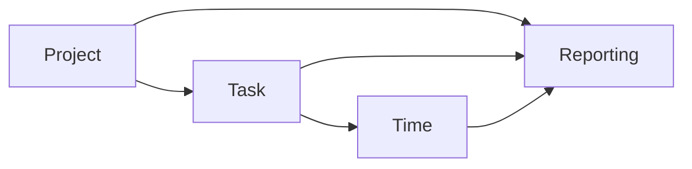

https://www.section.io/engineering-education/api-authentication-with-django-knox-and-postman-testing/

https://www.velotio.com/engineering-blog/using-drf-for-faster-apis

Super User Credentials:
```
user = admin
pass = admin1234
```

---
Time Tracker Models:

each task is related to one project.
    assignee is responsible for delivering the task.
    acceptance_criteria is a note for the owner to
    confirm the task is done and a description for
    assignee to know what should be delivered.
each task can get done with many doers in different times.
All times are stored in database as Float timestamp to reduce memory usage.
size of a float timestamp is about 24 bytes, while size of a datetime is about 48.

---

A Celery Task will calculate daily reports each day